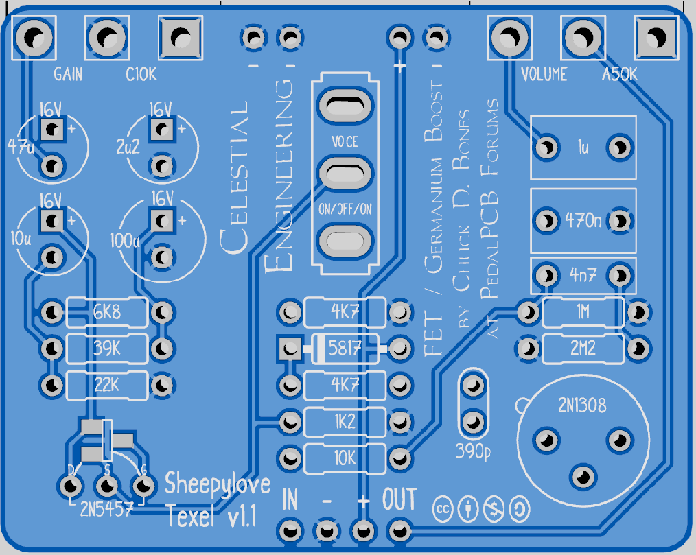

# pedal-texel

 This work is licensed under a <a rel="license" href="http://creativecommons.org/licenses/by-nc-sa/4.0/">Creative Commons Attribution-NonCommercial-ShareAlike 4.0 International License</a>.

This is based on the FET / Germanium Boost by Chuck D. Bones at the PedalPCB forums:
<https://forum.pedalpcb.com/threads/this-week-on-the-breadboard-fet-germanium-boost.9281/>

This repository contains:

* A gerber file to produce the PCB.
* A gerber file to produce the PCB with a location specified for the production number if using JLCPCB.
* A schematic.

There is no support supplied or guaranteed for the PCB. I have built it and it works, YMMV.

## Build notes

* Use a SMD for the JFET. The uniformity of SMD components is better than through-hole. The board is marked for 2N5457 but many will work (2N5246, J201, 2SK30A-D). Look for a Vp of ~1.4V
* The NPN Germanium transistor is not too picky. You can tweak the 39K resistor to adjust the collector voltage. I used 2N1304 instead of the original 2N1308, but MP38A have also been used to great effect.
* Voice:
  * Down - Gain increased 10dB across the frequency range, with gradual bass roll-off below 200Hz. Adjust the 2u2 capacitor for fatter bottom-end.
  * Center - Flat frequency response. Gain from 11dB to 40dB. Clean with gain below noon.
  * Up - Treble booster. Bass roll-off below 450Hz. Clean with gain below 10:00.

## PCB image

